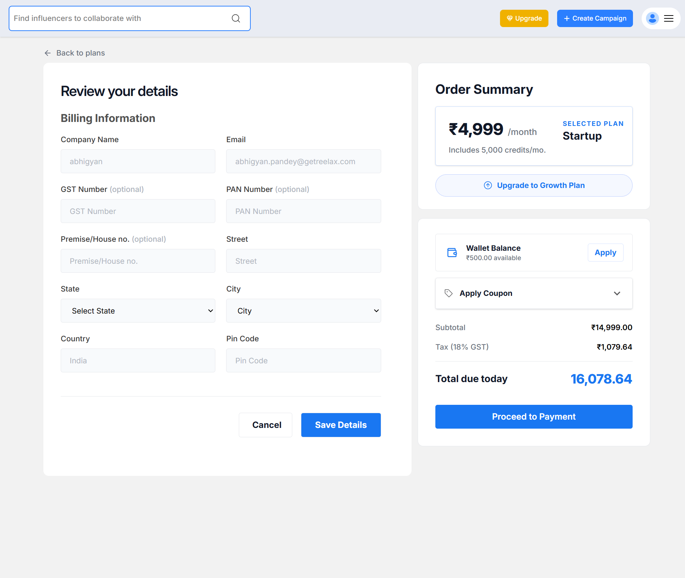
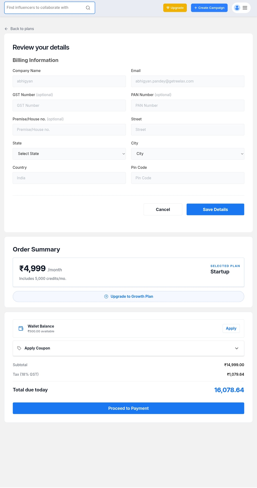

# Reelax Frontend Assignment

A pixel-perfect React implementation based on the provided Figma design for the Frontend Developer Intern assignment.

## Live link
https://react-assignment-tau-cyan.vercel.app/

## 📌 Features

- Pixel-perfect UI implementation
- Fully responsive design
- Reusable component architecture
- Form validation
- Clean and scalable folder structure
- Tailwind CSS styling
- React functional components with hooks
- Deploy on Vercel

---

## 🛠 Tech Stack

- React JS
- Vite
- Tailwind CSS
- JavaScript
- React Icons

---

## 📂 Folder Structure

```bash
src/
│
├── components/
├── assets/
├── App.jsx/
├── index.css/
└── main.jsx/


## 📸 Screenshots

### 💻 Desktop View



---

### 📱 Tablet View



---

### 📱 Mobile View


## Contact details

mohammedzain4099@gmail.com
7017072533